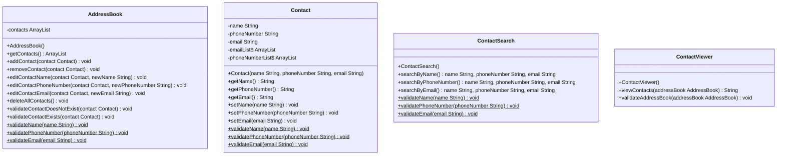

# Class Diagrams and Test Plan

# Test Plan

## Contact
- **Test 1:** Test that the name of the contact cannot be null
- **Test 2:** Test that the name of the contact cannot be empty
- **Test 3:** Test that the phone number of the contact cannot be null
- **Test 4:** Test that the phone number of the contact cannot be empty
- **Test 5:** Test that the email of the contact cannot be null
- **Test 6:** Test that the email of the contact cannot be empty
- **Test 7:** Test that a contact cannot be added with the same email as another contact
- **Test 8:** Test that a contact cannot be added with the same phone number as another contact

## AddressBook
- **Test 1:** Test that a contact can be added to the address book
- **Test 2:** Test that the correct contact has been added to the address book
- **Test 3:** Test that a contact cannot be added if it already exists
- **Test 4:** Test that a contact can be removed from the address book
- **Test 5:** Test that a contact cannot be removed if it does not exist
- **Test 6:** Test that a contact's name can be edited
- **Test 7:** Test that a contact's phone number can be edited
- **Test 8:** Test that a contact's email can be edited
- **Test 9:** Test that a contact cannot be edited if it does not exist

## ContactSearch
- **Test 1:** Test that the email and phone number are displayed when a name is searched for
- **Test 2:** Test that a contact cannot be searched for if it does not exist
- **Test 3:** Test that a contact cannot be searched for if the name is null
- **Test 4:** Test that a contact cannot be searched for if the name is empty

## ContactViewer
- **Test 1:** Test that all contacts can be viewed
- **Test 2:** Test that the contacts cannot be viewed if there are none (the address book is empty)

